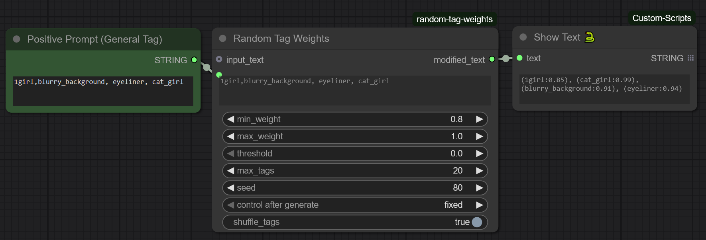

# 🧩 ComfyUI - Random Tag Weights Node

donate so I can get a 5090, thank you

A custom **ComfyUI** node that randomizes tag weights for text prompts.  
Useful for dynamic prompt generation or creative experimentation in AI image workflows.

---

## ✨ Features

* Randomly generates weights for each tag (e.g., `(dog:1.2)`)
* Detects and optionally preserves existing weighted tags `(tag:1.0)`
* Supports grouped tags inside parentheses, treating `(small dog)` as a single tag
* Allows splitting tags by **commas** or **spaces**
* Filters tags based on a minimum weight threshold
* Optionally shuffles the order of output tags
* Supports maximum output tag limits
* Allows reproducible randomness via a seed
* Lets you choose comma-separated or space-separated output formatting
* Supports both inline text input and external `input_text` connections

---

## ⚙️ Parameters

| Name                        | Type            | Description                                                 |
| --------------------------- | --------------- | ----------------------------------------------------------- |
| `text`                      | string          | Base tag list or general text input                         |
| `min_weight`                | float           | Minimum random weight                                       |
| `max_weight`                | float           | Maximum random weight                                       |
| `threshold`                 | float           | Minimum weight to include a tag                             |
| `max_tags`                  | int             | Maximum number of output tags                               |
| `seed`                      | int             | Random seed for reproducibility                             |
| `shuffle_tags`              | bool            | Shuffle tags before output                                  |
| `detect_by_commas`          | bool            | ON = split by commas, OFF = split by spaces                 |
| `group_parentheses`         | bool            | Treat `( ... )` groups as one tag                           |
| `preserve_existing_weights` | bool            | If a tag already has `(tag:1.0)` weight, leave it unchanged |
| `output_with_commas`        | bool            | Output tags joined by commas (ON) or spaces (OFF)           |
| `input_text`                | optional string | External input that overrides the `text` field              |

---

## 🧠 How It Works

1. The node reads the source text (`text` or `input_text`).
2. Any tags already in `(tag:weight)` format are extracted and preserved or re-weighted depending on settings.
3. Parentheses groups like `(small bird)` are treated as single tags and processed.
4. The remaining text is split into tags based on commas or spaces.
5. Each tag is assigned a random weight between `min_weight` and `max_weight`.
6. Tags with weights below `threshold` are discarded.
7. Tags are shuffled (if enabled) and trimmed to `max_tags`.
8. The final output is formatted as `(tag:weight)` using either commas or spaces, for example:
   `(dog:1.2), (cat:1.0), (small bird:1.1)`

---

## 📦 Installation

1. Download or clone this repo into your `ComfyUI/custom_nodes` folder
 

2. Restart ComfyUI — your new node will appear under the Text category!

---

## 🖼️ Workflow 

## 🖼️ Screenshot

